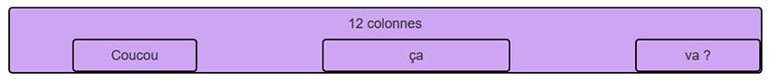
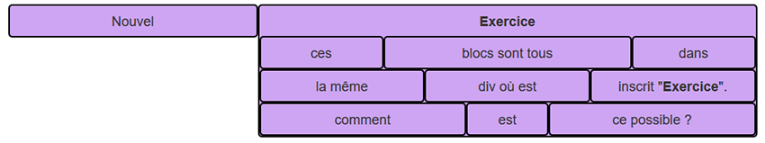
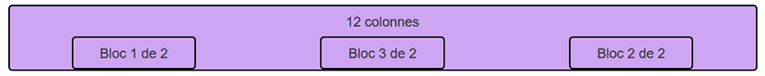
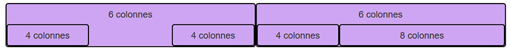
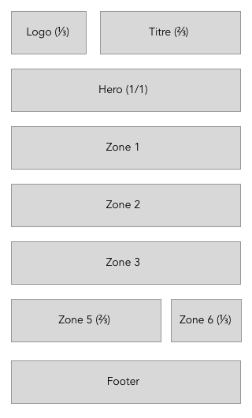
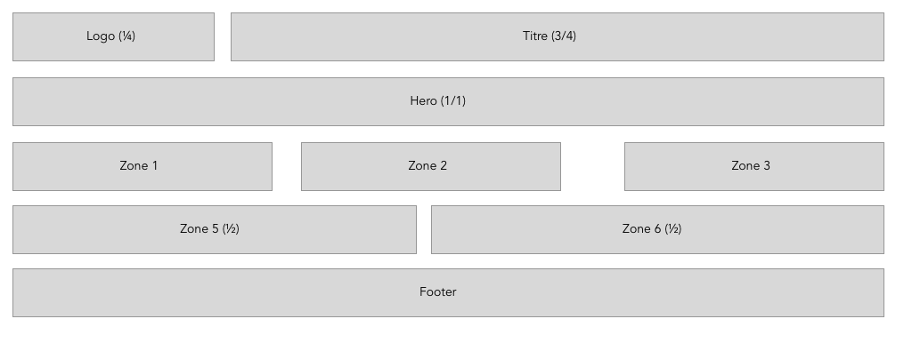

= Initiation

Type of challenge: *learning* +
Repository: *exercises-bootstrap* +
Duration: *4 hours* +
Team challenge: *solo*

== Learning objectives

At the end of this challenge you should be able to:

* to place elements using *Bootstrap*

== The mission

This challenge will have you play with *Bootsrap*, specifically its grid system.
Create a repository called _exercises-bootstrap_ and follow the instructions
below.

=== Exercises

.Instructions
* research *Bootstrap*
* create the repository
* with *Bootstrap* realise the layout below

==== I - blocs positioning

==== II - imbricated elements

==== III - change elements order

==== IV - practice makes good

==== V - responsive layout

.Mobile

.Desktop

=== Resources

* https://getbootstrap.com[documentation]

== Congrats

This challenge should have gotten you familiar with *Bootstrap*, it can be a
useful tool able to let you gain some time, but as any tool it requires
practice.

image::https://media.giphy.com/media/3oEjI105rmEC22CJFK/giphy.gif[]
