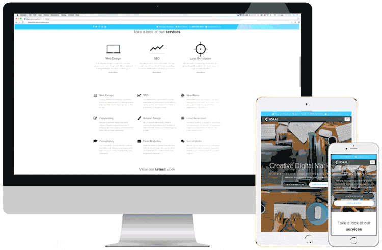

# Responsive Web Design

## The Problem

**Multiplicity of Screens**
Today, the same content can be seen on different sized; HD TV, a laptop, a watch, a smartphone. You can imagine the content should adapt for each devise. So how? A code-base for each platform? Duplicating the code for each version of the same website?

The problem came to be in 2007 with the surge of the first Iphones, from then on it's been a rush of new sizes. The industry needed time to adapt and find a new standard. In 2010, the web designer [Ethan Marcotte](https://twitter.com/beep) introduced the term "Responsive Web Design" or (RWA) in this on [A List Apart](http://alistapart.com/article/responsive-web-design).

## The solution : CSS Media Queries
With Media Queries, we can tell the navigator : if the size of the screen is X, use these css properties, otherwise those.
The expected UX result is something like this :

The RWA has led to a new way of looking at a site, increasingly differentiating between substance (content) and appearance (the container: the device).

## Your turn
1. [Learn to use them here](https://www.w3schools.com/css/css_rwd_mediaqueries.asp).
2. Perform these few exercises to take them in hand.

### 1. Change the colour
Create a HTML file and a CSS file.
Make it so the background color of Body is **red** when the width of the viewport is smaller than 300px, **green** when the viewport width is bigger than 300px and smaller than 768px, and **blue** when the viewport is bigger than 768px.

### 2. Display / hide elements
Add three `div`: one div with the id="small", one div with the id="medium", another div with the id="large". In each element add the word small, medium and large to its content for display purposes.

Make it so only one DIV is displayed, according to the width of the current viewport.

### 3. Adapt the size of the text according to the device
In each DIV, add a title and a few paragraphs (lorem ipsum, and such). Give the title a descriptive text (for example: "Content for smartphones")
Change the font size according to the device type.

### 4. Re-Arrange
Make it so that :
- if small, the 3 divs are stacked on top of one and other.
- if medium, the first div takes 2/3 of width, the second 1/3 of width and the third the full width.
- if big, the 3 divs should be next to one and other.

## Done? Congratulations, have your content behave !

