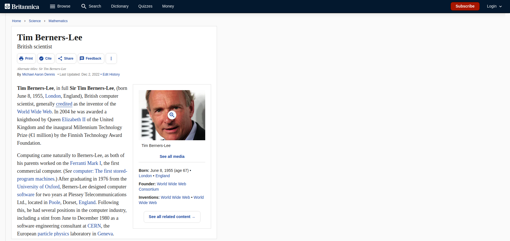

= Tim Berners-Lee

// links
:timmy: https://fr.wikipedia.org/wiki/Tim_Berners-Lee
:mockup: https://en.wikipedia.org/wiki/Mockup
:font_awesome: https://www.bootstrapcdn.com/fontawesome/
:cdn: https://en.wikipedia.org/wiki/Content_delivery_network
:font_awesome_cdn: https://www.bootstrapcdn.com/fontawesome/
:webP: https://developers.google.com/speed/webp

Type of challenge: *consolidation* +
Duration: *180 min* +
Deadline: *14/12/22 12h30* +
Deployment strategy: *Github page* +
Team challenge: *solo* +
Project submission form:  https://forms.gle/pgvSEZR2mWuPKfaH9

== Mission objectives

* Make a page on *Tim Berners-Lee*
* Understand the principles of *HTML* and *CSS*
* Present your page and code

== The mission

You might not know him, but as the inventor of *HTML*, {timmy}[Tim Berners-Lee]
is the cause to all your current fun and problems. In his honor, you will make a
web page, following a predefined {mockup}[mockup]. For this project create a new
repository called _tim-berners-lee_ with an _images_ folder.

=== Instructions

.Setup
* create the repository
* create an _images_ folder
* add a project description to the _README.md_
* add a link to the *github page* in the _README.md_
* download the pictures below into the _images_ folder

.HTML
* write the _index.html_
* Your code must be correctly *indented*
* The code must be in *HTML5*

.CSS
* write the _style.css_
* separate the elements into different blocks
* implement the diferents elements (fonts, image, logo, ... )
* the result must look like the image below

.Git
* commit/push
* deploy on a Github page

== Congrats

You can be proud of yourself, you implemented your first *mockup* into *HTML*
and *CSS*. You might think it's a small task, but think about all you've learned
to produce this.

image::https://media.giphy.com/media/d20PG6M6SAFqtmce9r/giphy.gif[]
