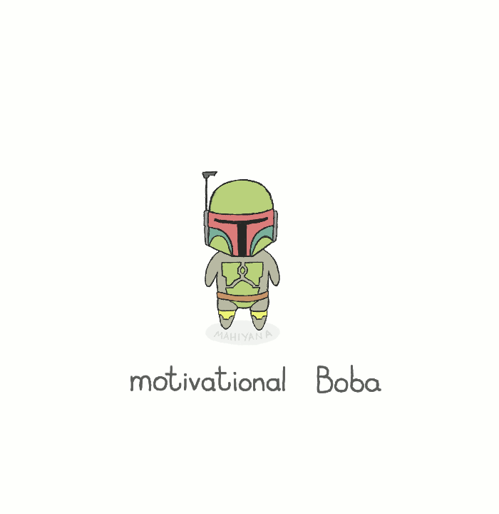

# Welcome to The field!

During this first part you will build the bases of your future. We have confidence in your abilities, that's why you were selected. Remember that you grow up in a group. Don't hesitate to ask her for help if you need it. And don't forget to give back to the group what you received. Good luck and courage!

## INDEX

1. [Terminal](./1.Terminal)
2. [Git](./2.Git)
3. [Markdown](./3.Markdown)
4. [Markdown challenge](./4.Markdown-challenge)
5. [Markdown Final](./5.Markdown-Final)
6. [Git RECAP](./6.Git-RECAP)
7. [Intro html/css](./7.Intro-Html-CSS)
8. [Html / css](./8.Html-CSS)
9. [Algorithmics](./9.Algorithmics)
10. [Bootstrap](./10.Bootstrap)

