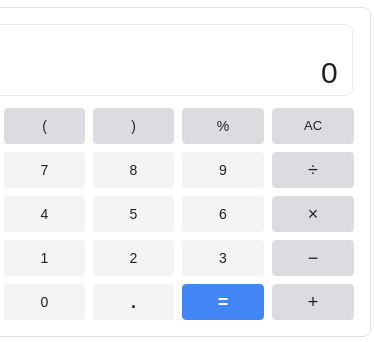

# Let's build a calculator

Using what we know about javascript, we're going to build a simple calculator app.

- Type of challenge: `consolidation`
- Duration: `2 days`
- Team challenge: `solo`

## Learning objectives

At the end of this challenge you should be able to generate a simple app using the DOM utils and events.

## The mission

⭐️ Below you will see the instructions for a typical calculator, but don't be afraid to experiment with other types of calculator (and even use 1 or 2 graphs along the way?) , here are a few for example: ⭐️

- [body weight index](https://dribbble.com/shots/6922560-Calorie-Counter-Daily-UI-004)
- [mortgage calculator](https://dribbble.com/shots/14697418-Mortgage-calculator-ui-design)
- [cryptocurrency calculator](https://dribbble.com/shots/14787589-Cryptocurrency-Loan-Calculator)
- [game inspired calculator (Animal Crossing)](https://dribbble.com/shots/11284573-Calculator-Daily-UI-004)
- [calculator-typical-animations](https://dribbble.com/shots/9549612-Calculator-App)

### Steps

- Create a new repository named `calculator`
- Create a `calculator.js` file. `//  calculator.ts if using  vite for a web app`
- Create a file named `index.html`. In the `<body>` add the basic layout for your calculator
  - display on top and all the digits buttons (0 to 9),
  - the operation buttons (`+`, `-`, `x`, `/`),
  - a button to calculate the result (`=`) and a button to clear the display (`C`)
  - ...etc
- Clicking on the buttons should emulate the behavior of a calculator.

### BONUS

- Make it pretty
- Create a history of the previous operations
- Scientific calculator (trigonometry, logarithms, ...). The [Math library](https://developer.mozilla.org/en-US/docs/Web/JavaScript/Reference/Global_Objects/Math) is pretty convenient for this.
- Unit conversion (could be money or imperial units to metric system for example)
- Pressing enter to display the result (same as pressing the `=` button)
- Pressing number keys on the keyboard should have the same effect as pressing the calculator buttons
- Is it responsive? Duh... 😉

## Resources

### Inspiration

Take a look at the [google calculator](https://www.google.com/search?q=calculator) for inspiration.



You can also look at your smartphone calculator app, or any app that is available online.

### The "result" button

Pressing on the `=` button should compute the whole line. Javascript has a function for this named `eval`, `EVAL IS EVIL` you should [never use that function](https://www.digitalocean.com/community/tutorials/js-eval).

Instead, I made a short function, it will do the trick, feel free to use it in your code:

```javascript
function computeResult(str) {
  return Function("return " + str)();
}

const a = "(13 + 17) / 3";

console.log(computeResult(a)); // Should display 10
```
