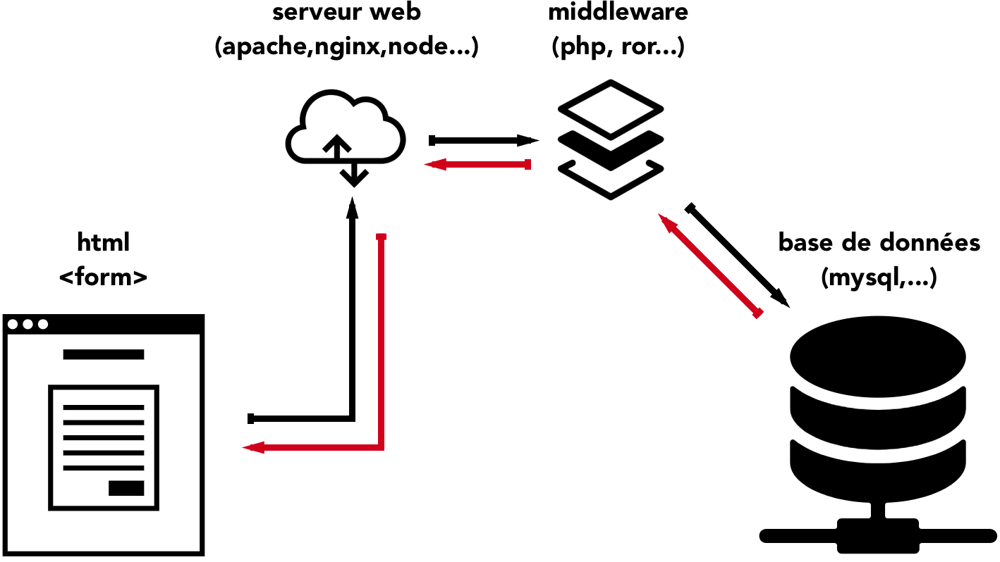

# Backend: processing a form

The term "backend" refers to the part of an application that runs on the web "server". This implies that there is another party, "frontend", which runs on the other computer, the "client".  Where the frontend meets display and user experience (simply called "UX") concerns, the backend will focus on the data itself and serve the frontend what it needs.  So in short:

Frontend = solving problems related to UX
Backend = solving problems realate to data: data access, data integrity & overall security. (That's why it helps to be a bit paranoiac to be a good backend developer.)

## CRUD
There is an almost infinite amount of project types that need a backend: CMS, CRM, Bug trackers, ERP, blogs ...  In this diversity, there is a recurrence: **content**, which in IT, is made of **data**. That content must be able to be created, modified, deleted, and of course, read by users of the system. These operations are refered to as **CRUD****: **C**reate, **R**ead, **U**pdate, **D**elete. 

For C and U, we need to offer the client (the browser, therefore the frontend) an interface to add or edit.  And for your application to have an interface on the web, it needs html code. HtML code that actually allows humans to input data. Welcome to the joyful little world of Forms and the exquisite `<form>` tag. 

This article explains what you need to do to set up a minimal but complete client-server interaction at the backend level.


## Client-server transaction

Data exchanges between the browser and the web server could be seen as a "conversation" between humans on a terrasse on a hot summer day: a client sits at a table and wants a drink. In real life, the client tells the waiter *"give me an orange juice*" and the waiter goes to the fridge, grab one, pours it into a glass and brings it to client.  
In computer science, it will more often be *"fetch this content from the database (the fridge), wrap it in html tags, then return it to browser"*. A Create transaction would be like *"add this content to the fridge (the database) "*. An Edit transaction, like *"modify this content and put it back in the fridge "*, and a Delete transaction : *"remove this rotten content from the fridge "*.  


Except... the frontend can't directly interact with a mysql server. It needs a middle man. 


We therefore need an intermediate layer (*middleware*) that can interact with both the frontend code (html) and the database server. For example, PHP, RubyOnRails, Java, or even javascript (via nodejs) can perfectly fulfill this role of *middleware*.  Through this role as an intermediary, it is understood that this middleman must protect the sacrosanct data of your application.



Now that you have the _big picture_ of a client-server transaction, let's move on to the practice.

## Frontend: creation of the form

Making a form is to ask questions. Kind of like an interview. So imagine you're interviewing a star. Take for example[Lou Reed](https://www.youtube.com/watch?v=oG6fayQBm9w). We could ask him these questions: *"what is your name?", "how old are you?", do you prefer Andy Warhol or Basquiat? Tell us about your life*.

#### Choosing the right inputs
In order to propose a good UX and also to have good, valid data (e.g. that age is always written with numbers) we must be careful to use the right _inputs_.

###### Think about each of these questions. What would be the most appropriate input?

######## 1. What's your name?
We expect to have... a short chain of characters. Which input(s) corresponds to this?

##### 2. How old are you?
We expect to have... a number made up of 1 to 3 digits. Which input(s) corresponds to this?

##### 3. Do you prefer Andy Warhol or Basquiat?
Here, we only want to receive one answer out of two proposals. Which input(s) corresponds to this?

##### 4. Tell me about your life.
Here, we expect to receive a potentially very long text.
Which input(s) corresponds to this?

#### Choose the right variable names
Whatever the input chosen, the attribute used to set the name of the variable that will be sent to the server is the attribute `name`, and the value will be specified in the attribute `value` (except for the `textarea`).

```html
<textarea name="biography">I was born in...</textarea>
<input name="fullname" type="text" value="Jeanne Maes">
<input name="age" type="number" value="18">
```

When the form is submitted by the user, the form data is sent to the script specified in the `action` attribute:

```php
<form method="post" action="form.php">
```

(Note that the request is actually sent by the browser to http://domainname.tld/path/to/the/form-processor.php.)

This data is accessible to the `form-processor.php' script via a global variable corresponding to the `method` attribute of the form: either `GET` or `POST`.

```php
// In PHP, the command
echo "<pre>";
print_r($_POST);

// returns
Array
(
    [name] => Lou Reed
    [biography] => I was born in...
    [age] => 68
)
```

So, if the method used is "post", the data are available in the superglobal variable `$_POST`. 

So, can you guess what the superglobal containing the data is called if the method used is "get"?

Good, awesome! That's all you need to know about the frontend side of the client-server transaction. The rest of your work on the client side is to improve the look and feel of your form via CSS and Javascript.

## Backend: form processing

On the server side, however, care must be taken not to expose the system to errors and hacking attempts.

This is why the processing of an external input (for example via an html form) must **always** go through these steps, and in this order :

1. Sanitize
2. Validate
3. Execute
4. Display (or redirect)

### 1. Sanitize
Sanitization** is used to prevent toxic content from entering your system. It is about avoiding corruption of your system, typically through malicious hacker attacks, or clumsiness of your users.


Example of sanitization in PHP :

```php
// 1. Sanitization
$email = filter_var($_POST['email'], FILTER_SANITIZE_EMAIL);
```

Here, `$email` contains a cleaned version of what was sent in the form. So if, for example, in the input, the user has put `>>>>lou@reed.org%dùf` (like his cat walked on the keyboard at that time), the function will return `lou@reed.org%df`. 

Cleaned... of dangerous codes, which does not mean that it is a valid email address ;-). 

(See the doc:[filter_var](http://php.net/manual/en/filter.filters.sanitize.php))

### 2. Validate
The **validation** is used to check that the input(s) provided are adapted to the constraints of your application (e. g. if the email is mandatory to register, it is necessary to check that the form contains a valid email address: accept `john@doe.com`, but refuse `john@doe`).  Here is a metaphor illustrating a validation that would have gone wrong....  


As you can see, the input presents a configuration not considered by the system designed by the aircraft designers.

In php, it would look like this: 

```php
// 1. Sanitisation
$email = filter_var($_POST['email'], FILTER_SANITIZE_EMAIL);

// 2. Validation
if (true ==== filter_var($email, FILTER_VALIDATE_EMAIL)) {
    echo "This cleaned email address is considered valid."
} else {
	echo "This cleaned email address is not valid. Sorry. xoxo."
}
```

**When building a validation, at least one condition is always used. ** If the variable (sanitized) passes the validation, it is executed. In other words, we do this, otherwise we do that.


### 3. Execute
At runtime, system changes are made to the database (typically CRUD changes: retrieving, inserting, updating and/or deleting data).


Typically, pressing this button will trigger a series of hidden operations from the user, but allowing the system to be changed (engine off > engine on).

For example, we could do this:

```php
// we initiate an array that will contain any potential errors.
$errors = array();
// 1. Sanitisation
$email = filter_var($_POST['email'], FILTER_SANITIZE_EMAIL);

// 2. Validation
if (false ==== filter_var($email, FILTER_VALIDATE_EMAIL)) {
   $errors['email'] = "This address is invalid."
}

// 3. execution
if (count($errors)> 0){
	echo "There are mistakes!";
	print_r($errors);
	exit;
}
// If we get here, it's because everything's fine, we can record
$bdd = new PDO('mysql:host=localhost;dbname=test','root', '');
//...

// 4. Display the response interface.
```


### 4. Display the new interface status
As the system has changed, the interface presented to the user must reflect this change.  
For example: return html displaying confirmation message or error message) or via redirection (in PHP, via ` header("Location: file.extension");`). 


So, I hope this short journey has helped you understand how to achieve client-server interaction via php (but the principles are the same for any backend language) and the concepts of sanitization and data validation.
