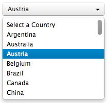

# PHP Loops


## Introduction

Washing the dishes... *Yuk, never liked that, never will*. 

Wash my plate? *No problemo*.  

```php
wash_plate();
```


But wash the 57 plates of yesterday's orgy...  *Euuuuuuuuh.... Excuse me ?*

```php
wash_plate();
wash_plate();
wash_plate();
wash_plate();
wash_plate();
wash_plate();
wash_plate();
wash_plate();
wash_plate();
wash_plate();
wash_plate();
wash_plate();
wash_plate();
wash_plate();
wash_plate();
wash_plate();
wash_plate();
wash_plate();
wash_plate();
wash_plate();
wash_plate();
wash_plate();
wash_plate();
wash_plate();
wash_plate();
wash_plate();
wash_plate();
wash_plate();
wash_plate();
wash_plate();
wash_plate();
wash_plate();
wash_plate();
wash_plate();
wash_plate();
wash_plate();
wash_plate();
wash_plate();
wash_plate();
wash_plate();
wash_plate();
wash_plate();
wash_plate();
wash_plate();
wash_plate();
wash_plate();
wash_plate();
wash_plate();
wash_plate();
wash_plate();
wash_plate();
wash_plate();
wash_plate();
wash_plate();
wash_plate();
wash_plate();
wash_plate();
```


But then, who likes to do the same thing 57 times ?

## Loops FTW !

With loops, you can have the same result in 3 lines of code : 

```php
$plates= array(1, 2, 3, 4, 5, ..., 57 );
foreach( $plates as $plate){
	wash_plate();
}
```
Yay! Much nicer !

This `foreach`is a logical structure called a **loop**. Loops are used whenever an instruction (or a series of instructions) need to be repeated several times.

In plain English you would read it as this : 
> For each element of the array `$plates`, call it `$plate` then apply the instruction : `wash_plate()`.


Let's take a more concrete example : imagine you receive an array of names called `$names`. You want to make sure that each name in it has the first letter capitalized. This native PHP function should do the job: `ucfirst($string);`. Since you need to do it to each element of the array, we can use a loop that will apply the modification. For instance : 

```php
$names= array('John', 'jeanne', 'Joan', 'émile');
foreach ($names as $name){
	echo ucfirst($name);
}
```

In plain English :   
> For each element of the array `$names`, call it `$name` then apply the function `ucfirst()` then display it. 

### Foreach, with the key index

In the previous example, we capitalize the first letter then display it, but the array itself still contains the non-capitalized names.
What would be better is to get the value, capitalize it then save it back in the array.
In order to do that, we could use the element's key index, to know where to save back the data. 


```php
$names= array('John', 'jeanne', 'Joan', 'émile');
var_dump($names);

foreach ($names as $key=> $value){
	$names[$key] = ucfirst($value);
}
var_dump($names);
```

Does this arrow sign `=>` rings a bell ? Yes, [associative arrays](./array.md)! It's logical, since a loop allows to traverse an array from the first index to the last.  So: whenever you think "array", there will be a loop nearby... Both often come in pair. 

### Exercises

- Here is an array :
```php
$pronouns = array ('I', 'You', 'He/She','We', 'You', 'They');
``` 

- Using `foreach`, build a loop that displays each element of the array
- Then, modify your loop so as to conjugate the verb "to code" in the present tense. Use a `<br>` to go to the next line.  The result should be : 

```php
I code
You code
He/She codes
We code
You code
They code

```

## You can also loop inside a string
### While loop

Bart Simpson has been (again) punished : he must copy 100 times "I shall not watch flies fly when I'm learning PHP".

Let's use another loop structure to do just that:  the `While`loop


```php
$amount_of_lines = 1;

while ($amount_of_lines <= 100)
{
    echo $amount_of_lines . '. : I shall not watch flies fly when I'm learning PHP.<br />';
    // shorthand writing for 
    // $amount_of_lines = $amount_of_lines +1;
    $amount_of_lines ++; 

}
?>
```

**In plain English : "WHILE `$amount_of_lines` is less or equal to 100, do the block of operations inside the brackets `{}`".**  

There are two instructions in the brackets :  

- `echo` which by now, you probably know really well;  
- And then something that looks a bit strange:  

```php
`$amount_of_lines ++;
```

Fear not : it's just a shorter way to add 1 to an Integer variable (an operation called **incrementation**). It's just the same as 

```php
$amount_of_lines = $amount_of_lines +1;
```
Therefore, on each loop iteration, the variable increments by one : 1, 2, 3, 4… 99, 100… 
When it reaches 101, the condition is not met anymore and the script exists the loop and continues down the file.

### For loop

Here is a third looping structure: the `For` loop.  Check this out :

```php
for ($amount_of_lines = 1; $amount_of_lines <= 100; $amount_of_lines ++)
{
    echo $amount_of_lines . '. : I shall not watch flies fly when I'm learning PHP.<br />';
}
```

After the keyword  `for`, we have a parenthesis with 3 parts, separated by `;` :

1. The first initiates a variable containing the starting counting value (here: value is 1)
2. The second is the condition to meet to let the loop continue. As for the While, as long as the condition is met, the loop keeps iterating. As soon as the condition becomes false, the loop stops and the script continues.
- Le premier sert à l'initialisation. C'est la valeur que l'on donne au départ à la variable (ici, elle vaut 1).  
- Finally, the third part is the incremental step. In this case, it's the shorthand notation of `$amount_of_lines = $amount_of_lines +1`


## Conclusion

Loops are a logic structure that is useful to repeat a block of instructions several times. 
`foreach`, `while`, `for` are the three different looping structures.

## Exercises

- Write a script that prints the numbers from 1 to 120 using ` while `  
- Write a script that prints the numbers from 1 to 120 using ` for `  
- Create an array containing the firstname of everyone in your startup. Display each firstname using a loop.
- Create an array containing at least 10 countries. Then, generate the html that will render a select box inside an html form (see mockup below). Of course, a loop will be useful...


 
- Now, edit your array so that it becomes an associative array: use the country ISO code as array key, and the country name as value. 
For example : 

```php 
$pays = array('BE'=>'Belgique');` 
```

- Now, adapt your html select box so that the country ISO code becomes the `<option>` element value, and the country name be the visible part of the `<option>`.
- Done! Congratz: that's exactly how an html select box should be done !


