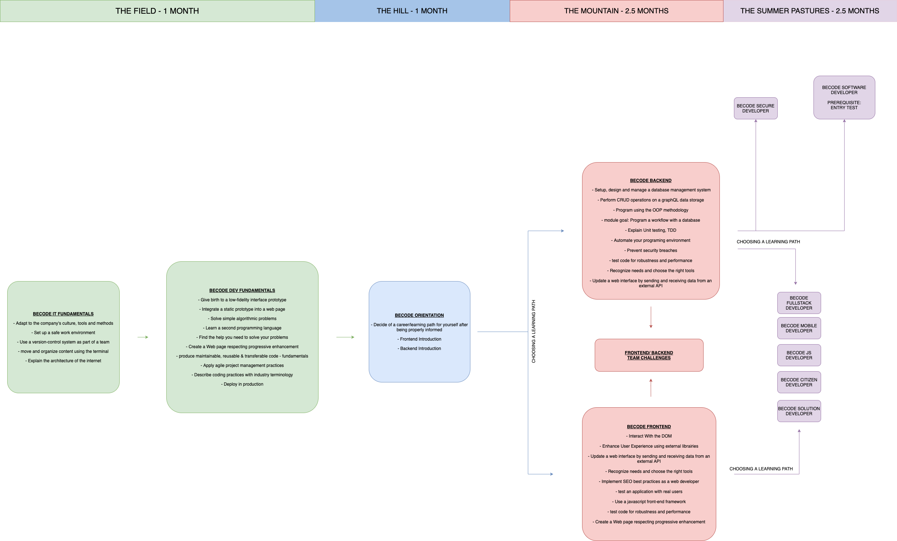

# BeCode

This repo is my go-to place for all information on my activities at BeCode: briefings, tutorials, etc.  

### 🌱 The field

- HTML: usage & semantics
- CSS: styling, preprocessors and frameworks
- Git: working in development teams
- IDE & terminal: your tools of trade

### 🏕️ The hill

- Programming concepts & logic
- JavaScript (JS): adding interactivity and connecting to external services

### ⛰️ The mountain

- PHP: object orientated programming, best practises and frameworks
- JS: frameworks
- Servers & hosting

### 🚠 Summer pastures

- Diving deeper in your technology of interest
- Bigger projects
- Sharing knowledge
- Preparing for internship

## 👩‍🎓 Briefings

Here is a chronological list of projects, in the order they were tackled by your startup.

1. [The Field](./1.The-Field)
2. [The Hill](./2.The-Hill)
3. [The Mountain](./3.The-Mountain)
4. [Summer-Pastures](./4.Summer-Pastures)
